# USPS PAF Admin Portal - Architecture Document

> **Version:** 1.0.0
> **Last Updated:** 2026-02-13
> **Status:** Active Development

---

## Table of Contents

1. [Executive Summary](#executive-summary)
2. [System Overview](#system-overview)
3. [Application Screenshots](#application-screenshots)
4. [Architecture Principles](#architecture-principles)
5. [System Architecture](#system-architecture)
6. [Component Architecture](#component-architecture)
7. [Data Architecture](#data-architecture)
8. [AI/ML Architecture](#aiml-architecture)
9. [Security Architecture](#security-architecture)
10. [Deployment Architecture](#deployment-architecture)
11. [Technology Stack](#technology-stack)
12. [Architecture Decision Records](#architecture-decision-records)

---

## Executive Summary

The USPS PAF (Processing Acknowledgment Form) Admin Portal is a web-based administrative interface for managing NCOALink licensing operations, Customer Registration IDs (CRIDs), Mailer IDs (MIDs), and address validation services. The portal integrates AWS Bedrock AI capabilities for real-time anomaly detection, risk scoring, predictive analytics, and fraud detection across all postal operations.

### Key Capabilities

| Capability | Description |
|-----------|-------------|
| **PAF Lifecycle Management** | Create, review, approve, monitor, and expire NCOALink Processing Acknowledgment Forms |
| **CRID/MID Administration** | Manage Customer Registration IDs and Mailer IDs with compliance tracking |
| **Address Intelligence** | AI-powered address validation using AWS Bedrock + AMS API integration |
| **Anomaly Detection** | Real-time monitoring using Z-Score, Isolation Forest, and Time-Series algorithms |
| **Risk Scoring** | Automated 0-100 risk assessment for all PAF entities |
| **Fraud Detection** | Pattern-based fraud analysis for data exfiltration, unauthorized access, and address abuse |
| **Predictive Analytics** | Forecasting for PAF expirations, volume trends, and compliance risk |

---

## System Overview

```
                    ┌──────────────────────────────────────────────┐
                    │              USPS PAF Admin Portal            │
                    │           (React SPA - Vite Build)           │
                    └──────────────────┬───────────────────────────┘
                                       │
                    ┌──────────────────┴───────────────────────────┐
                    │            Application Shell                  │
                    │  ┌─────────┐  ┌──────────┐  ┌────────────┐  │
                    │  │ Sidebar │  │  Header   │  │   Router   │  │
                    │  └─────────┘  └──────────┘  └────────────┘  │
                    └──────────────────┬───────────────────────────┘
                                       │
          ┌───────────────┬────────────┼──────────────┬────────────┐
          │               │            │              │            │
    ┌─────┴─────┐  ┌──────┴─────┐ ┌───┴────┐  ┌─────┴──────┐ ┌──┴───────┐
    │ Dashboard │  │    CRUD    │ │   AI   │  │  Address   │ │ Reports  │
    │   Page    │  │   Pages    │ │Insights│  │ Validation │ │   Page   │
    └─────┬─────┘  └──────┬─────┘ └───┬────┘  └─────┬──────┘ └──┬───────┘
          │               │            │              │            │
          └───────────────┴────────────┼──────────────┴────────────┘
                                       │
                    ┌──────────────────┴───────────────────────────┐
                    │              Service Layer                    │
                    │  ┌────────────────┐  ┌────────────────────┐  │
                    │  │ bedrockService │  │  anomalyService    │  │
                    │  │ (Address AI)   │  │  (Intelligence)    │  │
                    │  └───────┬────────┘  └────────┬───────────┘  │
                    └──────────┼─────────────────────┼─────────────┘
                               │                     │
                    ┌──────────┴─────────────────────┴─────────────┐
                    │             AWS Bedrock API                   │
                    │  ┌──────────────────────────────────────┐    │
                    │  │ anthropic.claude-sonnet-4-5-20250929  │    │
                    │  └──────────────────────────────────────┘    │
                    └──────────────────────────────────────────────┘
```

---

## Application Screenshots

### Dashboard
The main dashboard provides an at-a-glance view of all portal KPIs with an AI executive summary banner, metric cards, processing volume charts, and real-time anomaly alerts.

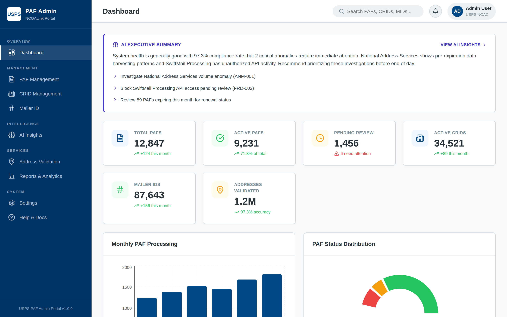

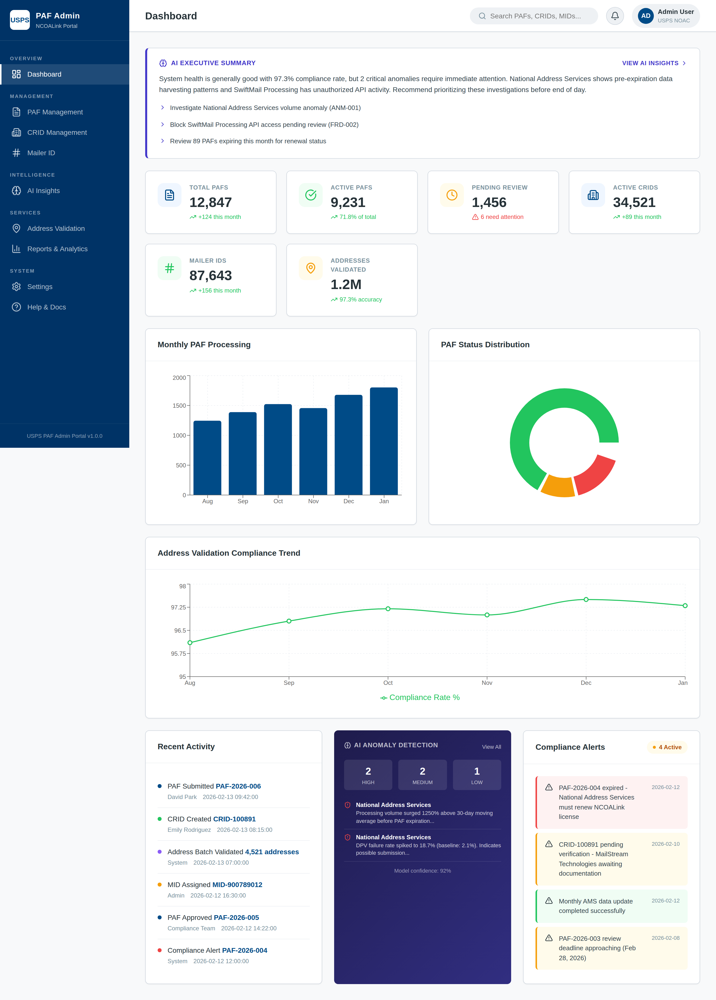

### PAF Management
Full PAF lifecycle management with search, filtering, inline AI risk scores, and detail modals showing comprehensive PAF data including AI risk assessment.

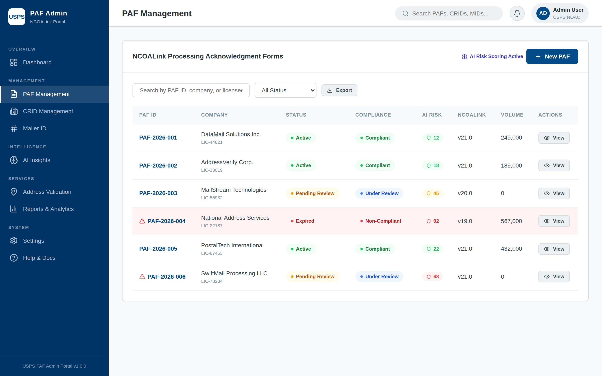

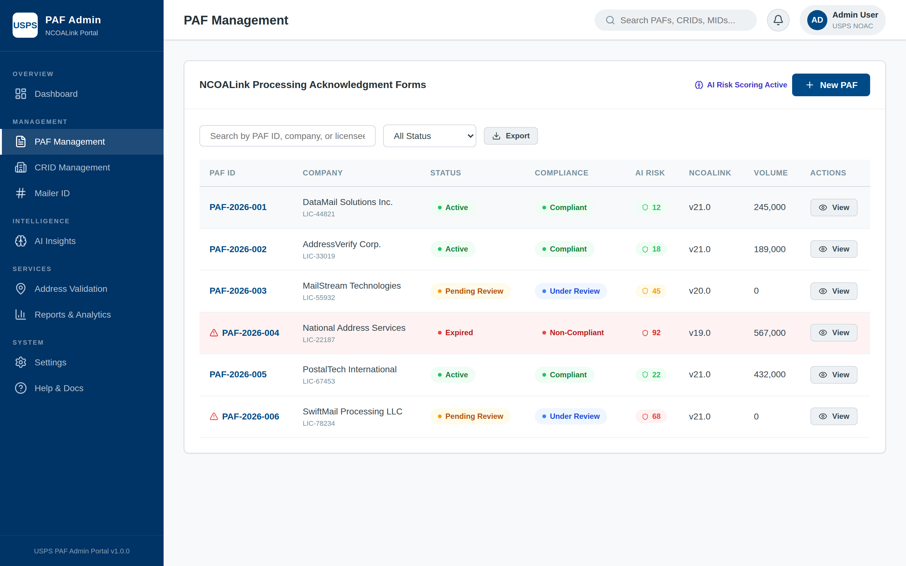

### CRID Management
Customer Registration ID administration with anomaly monitoring flags and business detail views.


### Mailer ID Management
Mailer ID tracking with AI anomaly detection, data distribution profiles, and severity indicators.

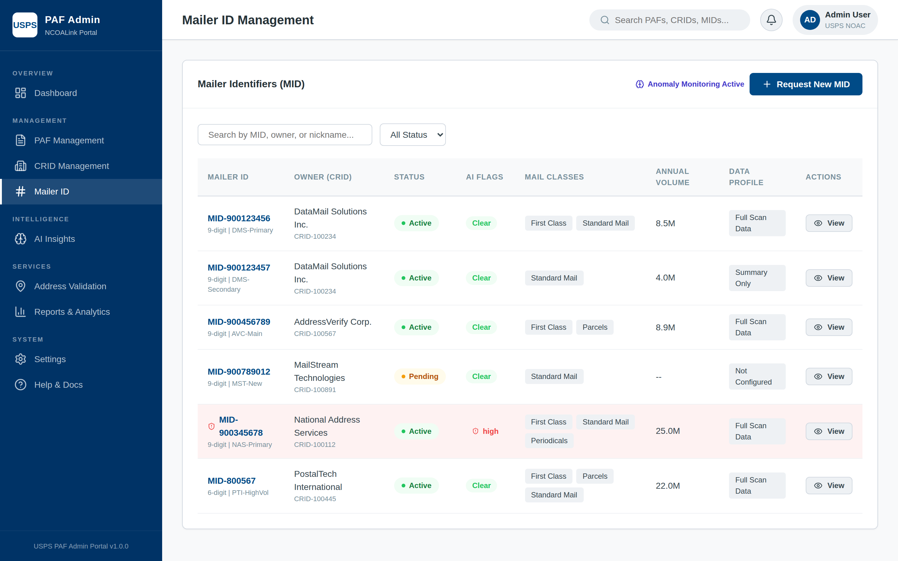

### AI Insights - Anomaly Detection
Comprehensive anomaly detection dashboard with severity metrics, 24-hour timeline, detection method status, and detailed anomaly cards with z-scores and recommendations.

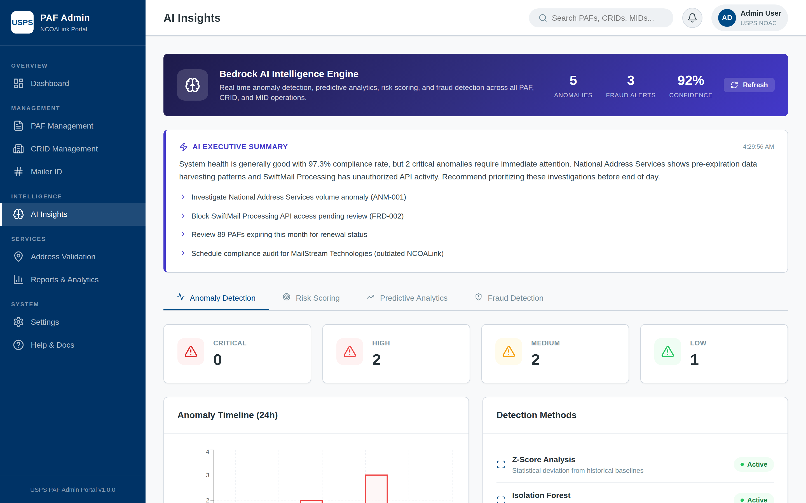

### AI Insights - Risk Scoring
Risk distribution visualization, overall system risk gauge (SVG), and per-PAF risk scoring table with factor tags.

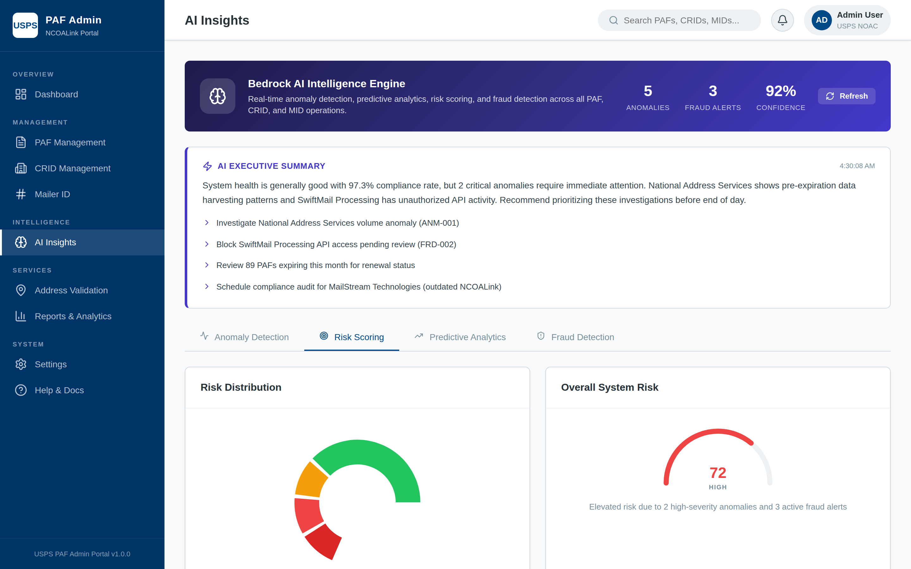

### AI Insights - Predictive Analytics
Forecasting dashboards for PAF expirations, volume trends with confidence intervals, compliance risk projections, and address quality forecasts.

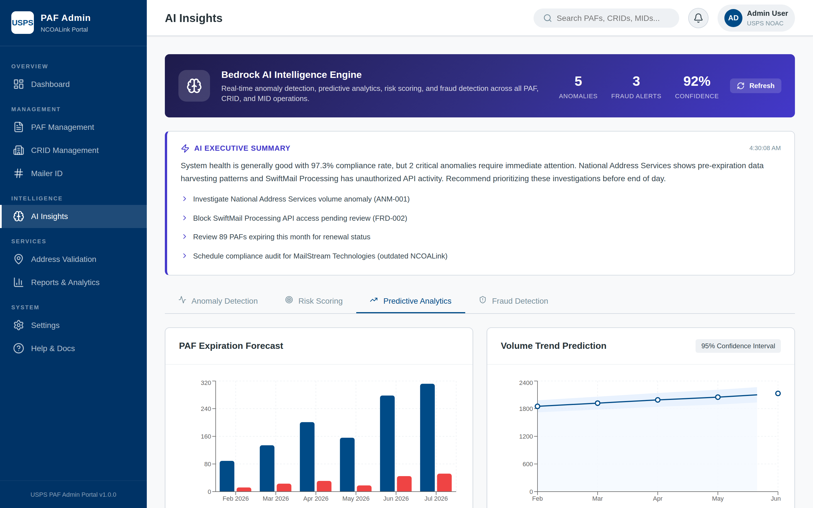

### AI Insights - Fraud Detection
Active fraud alert cards with confidence scores, behavioral indicators, and recommended enforcement actions.

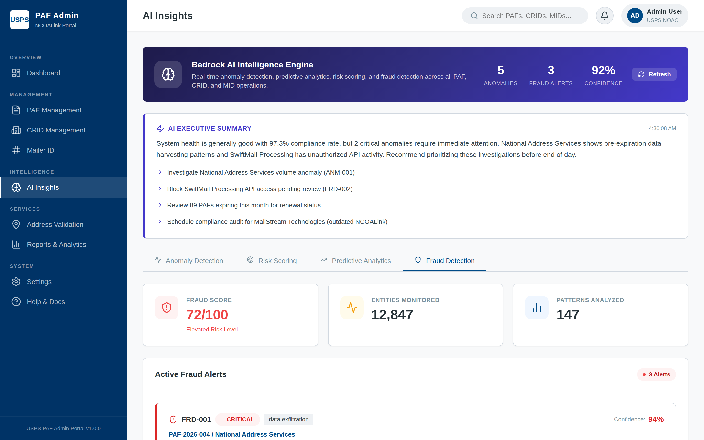

### Address Validation
AI-powered address validation with single and batch modes, DPV confirmation, NCOALink data, and confidence scoring via AWS Bedrock + AMS API integration.

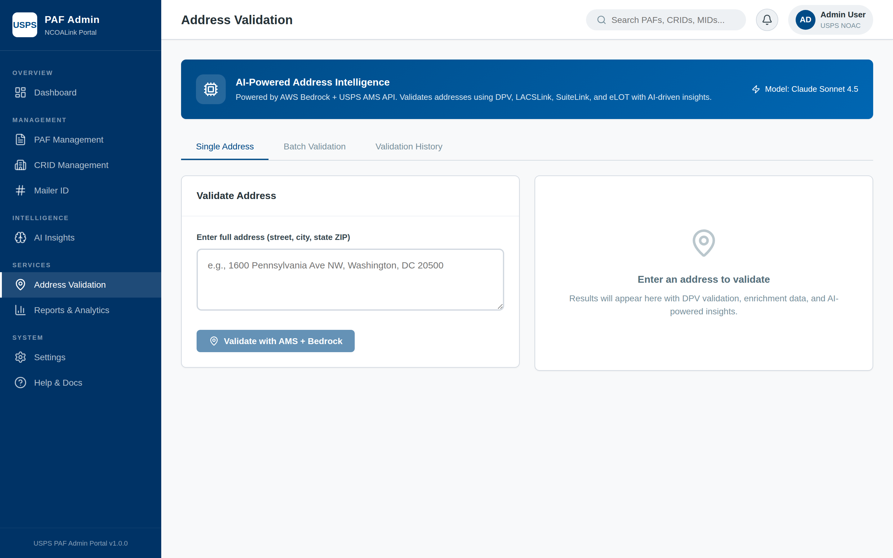

### Reports & Analytics
Compliance reporting, volume analytics, and licensee performance dashboards with downloadable report catalog.

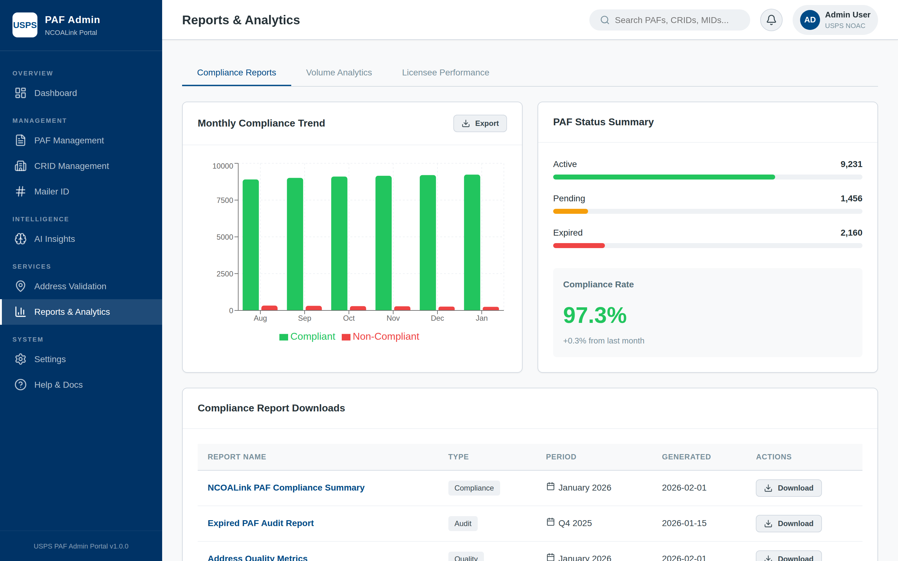

### Settings
System configuration including general settings, API configuration, AWS Bedrock model selection, and security settings.

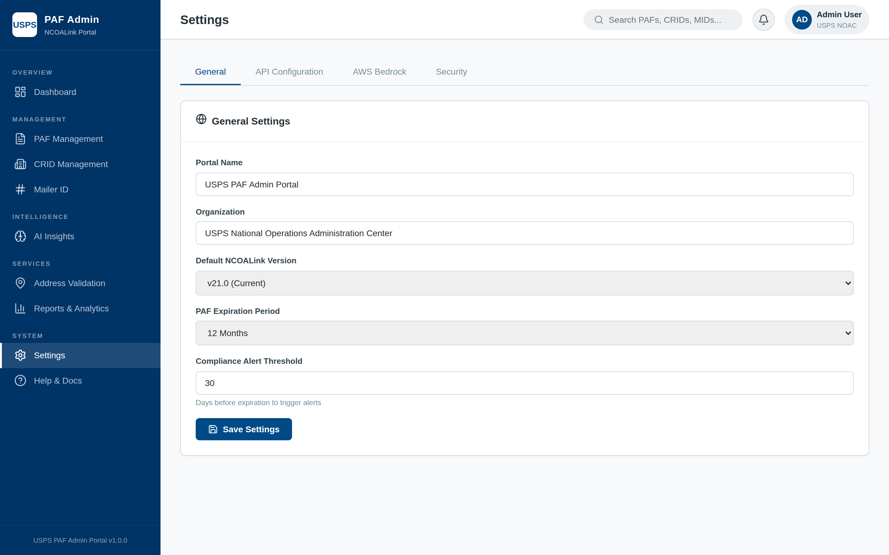

### Help & Documentation
Quick-start guide, resource library, and support contact information.

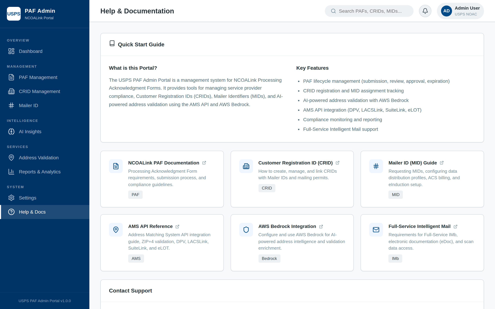

---

## Architecture Principles

| Principle | Description |
|-----------|-------------|
| **Component-Based** | UI decomposed into reusable, self-contained React components |
| **Service Abstraction** | All external integrations (Bedrock, AMS API) abstracted behind service interfaces |
| **Progressive AI Integration** | AI features augment existing views non-intrusively rather than replacing them |
| **Mock-First Development** | Simulated services mirror production API contracts for frontend-independent development |
| **Separation of Concerns** | Clear boundaries between UI presentation, business logic, and data access |
| **Fail-Safe AI** | AI features gracefully degrade - the portal remains fully functional without Bedrock |

---

## Component Architecture

### Directory Structure

```
usps-paf-admin/
├── public/                      # Static assets
├── src/
│   ├── components/              # Shared UI components
│   │   ├── Header.jsx           # Top navigation bar with search and user profile
│   │   ├── Sidebar.jsx          # Left navigation with route sections
│   │   └── StatusBadge.jsx      # Reusable status indicator badges
│   ├── data/
│   │   └── mockData.js          # Mock data store (replaces API in dev)
│   ├── pages/                   # Route-level page components
│   │   ├── Dashboard.jsx        # Main overview + AI summary + anomaly widget
│   │   ├── PAFManagement.jsx    # PAF CRUD + AI risk scores
│   │   ├── CRIDManagement.jsx   # CRID CRUD + anomaly flags
│   │   ├── MailerIDManagement.jsx # MID CRUD + anomaly flags
│   │   ├── AIInsights.jsx       # Dedicated AI intelligence hub (4 tabs)
│   │   ├── AddressValidation.jsx # Bedrock-powered address validation
│   │   ├── Reports.jsx          # Analytics and compliance reports
│   │   ├── SettingsPage.jsx     # System and API configuration
│   │   └── HelpPage.jsx         # Documentation and support
│   ├── services/                # External service integrations
│   │   ├── bedrockService.js    # AWS Bedrock address intelligence
│   │   └── anomalyService.js    # AWS Bedrock AI/ML analytics
│   ├── App.jsx                  # Root component with router
│   ├── main.jsx                 # Application entry point
│   └── index.css                # Global styles + design system
├── scripts/
│   └── take-screenshots.mjs     # Playwright screenshot automation
├── docs/
│   ├── ARCHITECTURE.md          # This document
│   ├── screenshots/             # Automated UI screenshots
│   └── adr/                     # Architecture Decision Records
├── index.html                   # HTML entry point
├── package.json                 # Dependencies and scripts
└── vite.config.js               # Build configuration
```

### Component Hierarchy

```
App (BrowserRouter)
├── Sidebar
│   └── NavLink[] (9 routes)
└── main.main-content
    └── Routes
        ├── Dashboard
        │   ├── Header
        │   ├── AI Summary Banner ─── anomalyService.generateAISummary()
        │   ├── MetricCards (6)
        │   ├── Charts (Bar, Pie, Line)
        │   ├── Recent Activity List
        │   ├── AI Anomaly Widget ──── anomalyService.detectVolumeAnomalies()
        │   └── Compliance Alerts
        ├── PAFManagement
        │   ├── Header
        │   ├── SearchBar + Filters
        │   ├── DataTable ──────────── anomalyService.calculateRiskScores()
        │   │   └── StatusBadge
        │   └── DetailModal
        │       └── AI Risk Assessment
        ├── CRIDManagement
        │   ├── Header
        │   ├── SearchBar + Filters
        │   ├── DataTable ──────────── anomalyService.detectVolumeAnomalies()
        │   └── DetailModal
        ├── MailerIDManagement
        │   ├── Header
        │   ├── SearchBar + Filters
        │   ├── DataTable ──────────── anomalyService.detectVolumeAnomalies()
        │   └── DetailModal
        ├── AIInsights
        │   ├── Header
        │   ├── Bedrock AI Banner
        │   ├── AI Summary Card
        │   └── Tabs
        │       ├── Anomaly Detection ── detectVolumeAnomalies()
        │       ├── Risk Scoring ─────── calculateRiskScores()
        │       ├── Predictive ────────── generatePredictions()
        │       └── Fraud Detection ──── runFraudAnalysis()
        ├── AddressValidation ────────── bedrockService.*()
        ├── Reports
        ├── SettingsPage
        └── HelpPage
```

### Route Map

| Route | Component | Services Used | AI Integration |
|-------|-----------|---------------|----------------|
| `/` | Dashboard | anomalyService | Summary, Anomaly Widget |
| `/paf` | PAFManagement | anomalyService | Risk Score Column |
| `/crid` | CRIDManagement | anomalyService | Anomaly Flags |
| `/mid` | MailerIDManagement | anomalyService | Anomaly Flags |
| `/ai-insights` | AIInsights | anomalyService (all) | Full AI Hub |
| `/address` | AddressValidation | bedrockService | Address AI |
| `/reports` | Reports | - | - |
| `/settings` | SettingsPage | - | Config UI |
| `/help` | HelpPage | - | - |

---

## Data Architecture

### Data Flow

```
┌─────────────────────────────────────────────────────────────────┐
│                        Data Sources                              │
│                                                                  │
│  ┌──────────────┐  ┌──────────────────┐  ┌──────────────────┐  │
│  │  mockData.js  │  │  bedrockService  │  │  anomalyService  │  │
│  │ (Static Data) │  │ (Address Intel)  │  │  (AI Analytics)  │  │
│  └──────┬───────┘  └────────┬─────────┘  └────────┬─────────┘  │
│         │                    │                      │            │
└─────────┼────────────────────┼──────────────────────┼────────────┘
          │                    │                      │
          ▼                    ▼                      ▼
┌─────────────────────────────────────────────────────────────────┐
│                    React Component State                         │
│                                                                  │
│  useState() hooks in each page component                        │
│  Data fetched in useEffect() on mount                           │
│  Loading states managed per-component                            │
│                                                                  │
│  Pattern:                                                        │
│    useEffect(() => {                                             │
│      Promise.all([                                               │
│        detectVolumeAnomalies(),                                  │
│        calculateRiskScores(),                                    │
│        generateAISummary()                                       │
│      ]).then(([anomalies, risks, summary]) => {                  │
│        setAnomalies(anomalies);                                  │
│        setRisks(risks);                                          │
│        setSummary(summary);                                      │
│        setLoading(false);                                        │
│      });                                                         │
│    }, []);                                                       │
│                                                                  │
└─────────────────────────────────────────────────────────────────┘
```

### Mock Data Schema

| Entity | Fields | Records | Purpose |
|--------|--------|---------|---------|
| `pafs` | id, pafNumber, licensee, company, status, compliance, ncoalinkVersion, effectiveDate, expirationDate, associatedCrids, associatedMids, softwareProduct, contactEmail, processingVolume | 6 | PAF lifecycle tracking |
| `crids` | id, cridNumber, businessName, businessType, status, registrationDate, mailClasses, associatedMids, annualVolume, permitNumbers | 5 | Business registration |
| `mailerIds` | id, midNumber, ownerCrid, ownerName, status, assignedDate, mailVolumeLast30Days, dataDistribution, acsEnabled, eInductionEnabled | 6 | Mailer identification |
| `dashboardMetrics` | totalPafs, activePafs, pendingReview, expiredPafs, activeCrids, totalMailerIds, addressesValidated, complianceRate | 1 | KPI aggregates |

---

## AI/ML Architecture

### AI Service Layer

The portal's intelligence capabilities are delivered through two service modules that abstract AWS Bedrock API interactions:

```
┌─────────────────────────────────────────────────────────────┐
│                    AI Service Layer                           │
│                                                              │
│  ┌─────────────────────────────┐  ┌───────────────────────┐ │
│  │     anomalyService.js       │  │  bedrockService.js    │ │
│  │                             │  │                       │ │
│  │ detectVolumeAnomalies()     │  │ validateAddressWithAI()│ │
│  │   ├─ Z-Score Analysis       │  │ batchValidateAddresses│ │
│  │   ├─ Isolation Forest       │  │ getAddressSuggestions()│ │
│  │   └─ Time-Series Decomp.   │  │ analyzeAddressQuality()│ │
│  │                             │  │                       │ │
│  │ calculateRiskScores()       │  │ Model:                │ │
│  │   └─ Multi-factor scoring   │  │ claude-sonnet-4-5     │ │
│  │                             │  │                       │ │
│  │ generatePredictions()       │  │ Features:             │ │
│  │   ├─ Expiration forecast    │  │ ├─ DPV Validation     │ │
│  │   ├─ Volume trend           │  │ ├─ NCOALink Lookup    │ │
│  │   └─ Compliance risk        │  │ ├─ ZIP+4 Append       │ │
│  │                             │  │ ├─ Address Enrich     │ │
│  │ runFraudAnalysis()          │  │ └─ Quality Scoring    │ │
│  │   ├─ Data exfiltration      │  │                       │ │
│  │   ├─ Unauthorized access    │  └───────────────────────┘ │
│  │   └─ Address patterns       │                            │
│  │                             │                            │
│  │ generateAISummary()         │                            │
│  │   └─ Context-aware briefs   │                            │
│  └─────────────────────────────┘                            │
└─────────────────────────────────────────────────────────────┘
```

### Anomaly Detection Pipeline

```
Historical Data (30-day window)
         │
         ▼
┌─────────────────┐
│  Z-Score Engine  │───▶ σ > 2.0 flagged
└────────┬────────┘
         │
         ▼
┌─────────────────┐
│ Isolation Forest │───▶ Outlier partitioning
└────────┬────────┘
         │
         ▼
┌─────────────────┐
│  Time-Series    │───▶ Seasonal decomposition
│  Decomposition  │
└────────┬────────┘
         │
         ▼
┌─────────────────┐     ┌───────────────────────┐
│ Severity Rating │────▶│ Critical / High /      │
│ (0-100 z-score) │     │ Medium / Low           │
└────────┬────────┘     └───────────────────────┘
         │
         ▼
   Alert Generation
   ├── Dashboard Widget
   ├── Page-level Flags
   └── AI Insights Detail
```

### Risk Scoring Model

Each PAF entity receives a composite risk score (0-100) calculated from weighted factors:

| Factor | Weight | Source |
|--------|--------|--------|
| Compliance status | 25% | PAF record |
| NCOALink version currency | 15% | Software audit |
| Processing volume stability | 20% | Anomaly detection |
| Audit history | 15% | Compliance records |
| Software certification | 10% | CASS/MASS status |
| Geographic distribution | 10% | Address pattern analysis |
| API behavior | 5% | Access log analysis |

**Risk Levels:**
- **Low (0-30):** Normal operations, standard monitoring
- **Medium (31-60):** Enhanced monitoring, review within 30 days
- **High (61-80):** Active investigation required, restrict access
- **Critical (81-100):** Immediate action, suspend operations

### Fraud Detection Patterns

| Pattern | Indicators | Response |
|---------|-----------|----------|
| **Data Exfiltration** | Pre-expiration volume spike, sequential queries, off-hours activity | Revoke access, initiate investigation |
| **Unauthorized Access** | API calls before PAF approval, uncertified software, rate anomalies | Block API, require certification |
| **Address Abuse** | High DPV failure rate, fabricated address patterns, ZIP concentration | Quarantine batches, cross-reference |

---

## Security Architecture

### Authentication & Authorization (Planned)

```
┌──────────┐     ┌──────────────┐     ┌─────────────┐
│  User    │────▶│  Auth Layer  │────▶│   RBAC      │
│ (Browser)│     │  (OAuth 2.0) │     │  Engine     │
└──────────┘     └──────────────┘     └──────┬──────┘
                                              │
                                     ┌────────┴────────┐
                                     │   Role Matrix    │
                                     ├─────────────────┤
                                     │ Admin: Full CRUD │
                                     │ Analyst: Read+AI │
                                     │ Auditor: Read    │
                                     │ Viewer: Dashboard│
                                     └─────────────────┘
```

### Data Protection

| Layer | Mechanism |
|-------|-----------|
| **Transport** | HTTPS/TLS 1.3 (planned) |
| **API** | AWS IAM + Bedrock endpoint authentication |
| **Client** | Environment variable isolation for credentials |
| **Storage** | No PII stored client-side; all data transient |

### Environment Variables

```bash
VITE_AWS_REGION=us-east-1
VITE_BEDROCK_MODEL_ID=anthropic.claude-sonnet-4-5-20250929
VITE_BEDROCK_ENDPOINT=/api/bedrock
```

---

## Deployment Architecture

### Current (Development)

```
Developer Machine
├── Vite Dev Server (port 5173)
├── Hot Module Replacement (HMR)
└── Mock Service Layer (simulated latency)
```

### Target (Production)

```
┌─────────────────────────────────────────────────────────┐
│                     AWS Cloud                            │
│                                                          │
│  ┌─────────────┐     ┌──────────────┐                   │
│  │  CloudFront  │────▶│   S3 Bucket  │                   │
│  │  (CDN)       │     │ (Static SPA) │                   │
│  └──────┬──────┘     └──────────────┘                   │
│         │                                                │
│         ▼                                                │
│  ┌─────────────┐     ┌──────────────┐                   │
│  │ API Gateway  │────▶│   Lambda     │                   │
│  │              │     │ (Backend)    │                   │
│  └─────────────┘     └──────┬───────┘                   │
│                              │                           │
│         ┌────────────────────┼────────────────┐          │
│         ▼                    ▼                ▼          │
│  ┌─────────────┐  ┌──────────────┐  ┌──────────────┐   │
│  │  Bedrock    │  │  DynamoDB    │  │  Cognito     │   │
│  │  (AI/ML)    │  │  (Data)      │  │  (Auth)      │   │
│  └─────────────┘  └──────────────┘  └──────────────┘   │
└─────────────────────────────────────────────────────────┘
```

---

## Technology Stack

### Frontend

| Technology | Version | Purpose |
|-----------|---------|---------|
| **React** | 19.2.0 | UI framework |
| **React Router DOM** | 7.13.0 | Client-side routing |
| **Recharts** | 3.7.0 | Data visualization (Bar, Pie, Line, Area charts) |
| **Lucide React** | 0.563.0 | Icon library (Brain, AlertTriangle, Shield, etc.) |
| **Vite** | 7.3.1 | Build tool and dev server |
| **ESLint** | 9.39.1 | Code quality |

### Backend (Planned)

| Technology | Purpose |
|-----------|---------|
| **AWS Bedrock** | AI/ML inference (Claude Sonnet 4.5) |
| **AWS Lambda** | Serverless compute |
| **AWS API Gateway** | RESTful API management |
| **AWS DynamoDB** | Data persistence |
| **AWS Cognito** | Authentication and authorization |
| **AWS CloudFront + S3** | Static asset hosting and CDN |

### Development Tools

| Tool | Purpose |
|------|---------|
| **Playwright** | Automated screenshot generation |
| **Git** | Version control |

---

## Architecture Decision Records

The following ADRs document key architectural decisions made during development:

- [ADR-001: React + Vite as Frontend Framework](adr/001-react-vite-frontend.md)
- [ADR-002: AWS Bedrock for AI/ML Integration](adr/002-aws-bedrock-integration.md)
- [ADR-003: Mock-First Service Architecture](adr/003-mock-first-services.md)
- [ADR-004: Progressive AI Integration Pattern](adr/004-progressive-ai-integration.md)
- [ADR-005: Client-Side State Management](adr/005-client-side-state.md)
- [ADR-006: Anomaly Detection Algorithm Selection](adr/006-anomaly-detection-algorithms.md)

---

## Appendix: Design System

### Color Palette

| Token | Value | Usage |
|-------|-------|-------|
| `--usps-blue` | `#004b87` | Primary brand, sidebar, headers |
| `--usps-blue-dark` | `#003366` | Sidebar background, hover states |
| `--usps-red` | `#e31837` | Critical alerts, expired status |
| `--success` | `#22c55e` | Active status, low risk |
| `--warning` | `#f59e0b` | Pending status, medium risk |
| `--danger` | `#ef4444` | High risk, anomaly alerts |
| `--ai-purple` | `#7c3aed` | AI features, intelligence section |

### Layout Specifications

| Element | Dimension |
|---------|-----------|
| Sidebar width | 260px (fixed) |
| Header height | 64px (sticky) |
| Content padding | 24px |
| Card border radius | 12px |
| Max content width | Fluid |

### Typography

| Level | Size | Weight | Usage |
|-------|------|--------|-------|
| Page title | 24px | 700 | Page headers |
| Section title | 18px | 600 | Card headers |
| Body | 14px | 400 | General content |
| Caption | 12px | 500 | Labels, badges |
| Metric value | 32px | 700 | Dashboard KPIs |
